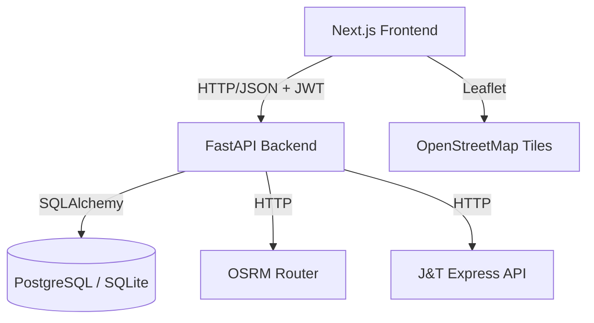

# Delivery Route Optimizer

Aplicação full-stack para otimizar rotas de entrega com TSP + OSRM, com autenticação por JWT e integração com a J&T Express.

## 🎯 Stack

- **Frontend:** Next.js 15, React 19, Tailwind, Leaflet (mapa open-source)
- **Backend:** FastAPI, SQLAlchemy, SQLite (dev) / PostgreSQL (produção)
- **Rota:** OSRM (Open Source Routing Machine — servidor público, grátis)
- **Autenticação:** JWT (email/senha, bcrypt)
- **Integração:** J&T Express API (importar pedidos)
- **Deploy:** Vercel (frontend) + Fly.io (backend ~$5/mês)

## 🚀 Features

- ✅ Cadastro/login com JWT; cada rota pertence a um usuário
- ✅ Endereços manuais ou importados de CSV (no navegador ou via upload para a API)
- ✅ Otimização automática da ordem (TSP nearest-neighbor) + traçado real do OSRM
- ✅ Mapa Leaflet com marcadores numerados na ordem de entrega
- ✅ Histórico de rotas com distância total
- ✅ Sincronização de pedidos da J&T Express
- ✅ 49 testes de backend (pytest) e 21 de frontend (Vitest)

## 🏗️ Arquitetura



## 📁 Estrutura

```
.
├── apps/web/              # Next.js (App Router)
│   ├── app/               # layout, página principal, estilos
│   ├── components/        # Login, RouteForm, RouteList, RoutePanel, RouteMap
│   ├── lib/               # cliente da API, parser de CSV, helpers de rota
│   └── tests/             # Vitest + Testing Library
├── services/api/          # FastAPI
│   ├── app/
│   │   ├── routes/        # auth, routes, deliveries, jet
│   │   └── utils/         # auth (JWT/bcrypt), optimization (TSP/OSRM), jet_integration
│   └── tests/             # pytest
├── examples/              # CSV de exemplo
└── docker-compose.yml
```

## 🛠️ Como rodar local

### Pré-requisitos
- Node.js 18+ e pnpm (`corepack enable`)
- Python 3.11+
- Docker + Docker Compose (opcional)

### Opção A — Docker Compose (tudo junto)

```bash
docker compose up --build
```

- Frontend: http://localhost:3000
- API: http://localhost:8000 · Docs: http://localhost:8000/docs

### Opção B — sem Docker

```bash
# 1. Backend
cd services/api
python -m venv .venv && source .venv/bin/activate
pip install -r requirements.txt
cp .env.example .env            # ajuste SECRET_KEY
uvicorn app.main:app --reload   # http://localhost:8000

# 2. Frontend (outro terminal)
pnpm install
cd apps/web
cp .env.example .env.local      # NEXT_PUBLIC_API_URL=http://localhost:8000
pnpm dev                        # http://localhost:3000
```

### Fluxo de uso

1. Registre-se na tela inicial (email + senha, mínimo 6 caracteres).
2. Crie uma rota digitando endereços ou importando `examples/entregas-exemplo.csv`.
3. Clique em **Otimizar Rota** — o backend reordena as entregas e busca o traçado no OSRM.
4. O mapa mostra os pontos numerados na ordem de entrega e a distância total.

> As coordenadas (latitude/longitude) são informadas junto com o endereço. Geocodificação automática (endereço → coordenadas) está no roadmap.

## ✅ Testes

```bash
# Backend — 49 testes
cd services/api && pytest

# Frontend — 21 testes
cd apps/web && pnpm test
```

Nenhum teste depende de rede: as chamadas ao OSRM e à J&T são mockadas.

## 🔌 API

| Método | Rota | Descrição |
|---|---|---|
| POST | `/api/auth/register` | Cria conta e devolve o token |
| POST | `/api/auth/login` | Autentica |
| GET | `/api/auth/me` | Usuário do token |
| GET/POST | `/api/routes/` | Lista / cria rotas |
| GET/DELETE | `/api/routes/{id}` | Detalhe / exclusão |
| POST | `/api/routes/{id}/optimize` | Otimiza a ordem (TSP + OSRM) |
| POST | `/api/routes/{id}/upload-csv` | Importa entregas de um CSV |
| POST | `/api/routes/{id}/sync-jet` | Importa pedidos da J&T |
| GET/POST/DELETE | `/api/routes/{id}/deliveries/` | Entregas da rota |
| PUT | `/api/routes/{id}/deliveries/order` | Ordem manual |
| GET/PUT/DELETE | `/api/jet-config/` | Credenciais J&T do usuário |
| GET | `/health` | Healthcheck |

Documentação interativa em `/docs`.

## ⚙️ Variáveis de ambiente

**Backend** (`services/api/.env`, veja `.env.example`):

| Variável | Padrão | Descrição |
|---|---|---|
| `DATABASE_URL` | `sqlite:///./delivery.db` | Postgres em produção |
| `SECRET_KEY` | valor de dev | **Troque em produção** (`openssl rand -hex 32`) |
| `ACCESS_TOKEN_EXPIRE_MINUTES` | `10080` | Validade do JWT (7 dias) |
| `OSRM_BASE_URL` | `https://router.project-osrm.org` | Instância do OSRM |
| `CORS_ORIGINS` | `*` | Origens liberadas, separadas por vírgula |
| `JET_API_BASE_URL` | vazio | Sem valor, a J&T roda em modo sandbox |

**Frontend:** `NEXT_PUBLIC_API_URL`.

## 📦 Deploy

Runbook completo em **[DEPLOY.md](./DEPLOY.md)**. Resumo:

**Backend (Fly.io)** — use `fly apps create`, não `fly launch` (ele sobrescreve o `fly.toml` do repo):

```bash
cd services/api
fly apps create delivery-route-optimizer-api
fly postgres create --name delivery-optimizer-db --region gru
fly postgres attach delivery-optimizer-db      # define DATABASE_URL
fly secrets set SECRET_KEY="$(openssl rand -hex 32)"
fly deploy
```

**Frontend (Vercel):** *Root Directory* = `apps/web`, com "Include source files outside of the Root Directory" ligado (o workspace pnpm fica na raiz), e `NEXT_PUBLIC_API_URL` apontando para a URL do Fly.io.

Custo: ~$5/mês (Fly.io shared-cpu-1x 256MB + Postgres) + Vercel grátis.

## 🤔 Decisões técnicas

- **OSRM vs Google Maps:** OSRM público é grátis e resolve o MVP; o Google Directions cobra por requisição. O `OSRM_BASE_URL` permite migrar para uma instância própria sem mexer no código.
- **Falha do OSRM não derruba a otimização:** se o roteador estiver fora do ar ou com rate limit, a rota ainda é reordenada e a resposta traz `estimated_distance_km` (linha reta) — o mapa cai para um traçado tracejado.
- **Leaflet vs Mapbox:** Leaflet é leve, open-source e integra direto com o OpenStreetMap, sem chave de API.
- **TSP nearest-neighbor:** simples e rápido, bom o suficiente para ~50–100 paradas. O limite de 100 coordenadas do OSRM público é validado antes da chamada.
- **JWT sem refresh token:** token de 7 dias no `localStorage` mantém o MVP simples; um fluxo de refresh entra quando houver app móvel.
- **Monorepo pnpm:** um só lugar para scripts, lockfile e CI, com o backend Python isolado em `services/api`.

## 🗺️ Roadmap

- [ ] Geocodificação (endereço → coordenadas) via Nominatim
- [ ] Algoritmo 2-opt / Lin-Kernighan para rotas maiores
- [ ] Integração com Shopee/Shein (importar pedidos)
- [ ] Dashboard com KPIs (distância média, tempo de rota)
- [ ] Notificação ao cliente quando a entrega sai
